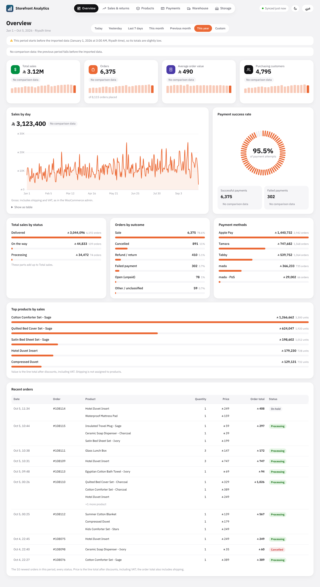
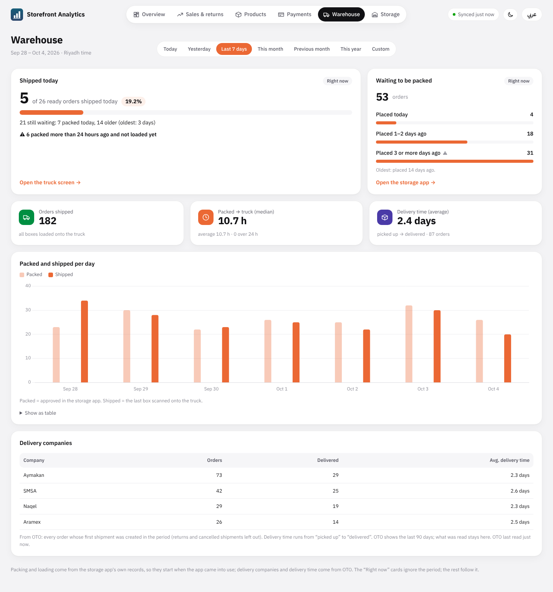
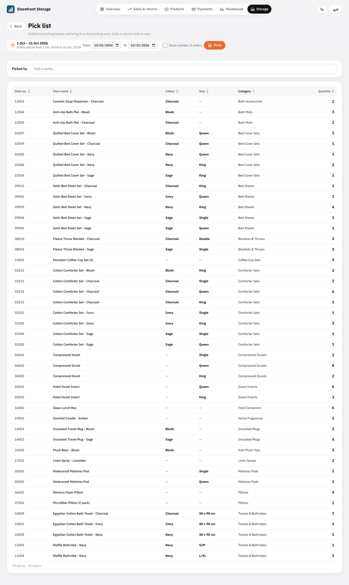

# Storefront Analytics

A real-time analytics dashboard **and** a warehouse pick-and-pack app for a
WooCommerce store, built as one small FastAPI + PostgreSQL service with a
plain HTML/CSS/JS front end (no build step). The bundled demo data is entirely
fake, for a made-up shop called *Acme Home Store*.

## Run the demo (about two minutes)

Needs Python 3.10+ and Docker.

```bash
cp .env.example .env                 # the demo needs no real WooCommerce key
docker compose up -d                 # PostgreSQL 16 on port 5434, schema applied

python -m venv venv && source venv/bin/activate     # Windows: venv\Scripts\activate
pip install -r requirements.txt

python -m scripts.seed_demo --reset  # ~8,000 fake orders, refunds, packing records
uvicorn app.main:app --reload
```

Open <http://127.0.0.1:8000/> for the dashboard and
<http://127.0.0.1:8000/storage> for the storage app. `--reset` wipes the order
and warehouse tables, so only use it on a demo database.

## Use it with a real store

1. Create a **read-only** WooCommerce REST key and put it in `.env`
   (`WC_BASE_URL`, `WC_KEY`, `WC_SECRET`). Never commit `.env`.
2. `python -m scripts.check_setup`, then
   `python -m scripts.backfill_orders --start 2026-01`,
   `python -m scripts.backfill_products`, `python -m scripts.backfill_refunds`.
3. Keep it current: `python -m scripts.reconcile --loop`.
4. Optional shipping data: add `OTO_REFRESH_TOKEN` and run
   `python -m scripts.sync_oto_tracking` (reads only; see `app/oto.py`).

Production: a Docker Compose stack with sync, nightly backups and a
Cloudflare Tunnel is in [deploy/RUNBOOK.md](deploy/RUNBOOK.md).



| Warehouse tab | Storage app (pick list) |
|---|---|
|  |  |

Also in the repo: [Arabic / right-to-left view](docs/screenshots/dashboard-overview-ar.png),
[dark mode](docs/screenshots/dashboard-overview-dark.png),
[sales & returns](docs/screenshots/dashboard-sales.png),
[orders to pack](docs/screenshots/storage-orders.png).

## What it does

- **Dashboard:** sales, orders, average order value, customers, % change versus
  the previous period (with an explicit "no comparison data" state), sales
  over time, order statuses, payment methods and success rate, top products,
  categories, returns, new vs returning customers, a weekday × hour heat map,
  cancellations. English and Arabic (RTL), light and dark.
- **Warehouse tab:** shipped today vs ready today, packing backlog by age,
  packed-to-truck time, per-carrier delivery times.
- **Storage app (`/storage`):** pick list, orders to pack (1 / 2 / 3+ pieces),
  barcode scanning of every piece, box count check against the shipping
  platform, packed list, loading boxes onto the carrier's truck, printable
  sheets with a driver signature block.
- **Sync:** one-off backfill, a reconciliation loop that keeps the database
  within minutes of the store, safe to interrupt and re-run.

**Core rule:** the dashboard never queries WooCommerce. Store data is synced
into PostgreSQL and every dashboard query runs against that, so it stays fast
even when the store is slow. Design decisions: [docs/DESIGN.md](docs/DESIGN.md).


## Layout

```
app/        FastAPI app: config, db, metrics (SQL), periods, warehouse, storage, OTO client
web/        dashboard + storage app: vanilla JS modules, i18n.js holds all wording (EN + AR)
db/         schema and seed SQL, applied automatically on first `docker compose up`
scripts/    backfill, reconcile, OTO sync, seed_demo (fake data)
tests/      fixture tests against a real PostgreSQL, API stubbed
deploy/     production stack (Compose, backup script, runbook)
```

## Tests

They write to a real database, so they refuse to run unless `POSTGRES_DB` ends
in `_test`:

```bash
docker compose exec db createdb -U storefront storefront_analytics_test
for f in db/0*.sql; do docker compose exec -T db psql -U storefront -d storefront_analytics_test < $f; done
export POSTGRES_DB=storefront_analytics_test
python -m tests.test_metrics     # also: test_storage, test_warehouse, test_backfill,
                                 #       test_refunds_products, test_reconcile
```

## Conventions

- Money is `NUMERIC(12,2)`, never float. Timestamps are UTC; days are computed
  in `REPORT_TIMEZONE` (default `Asia/Riyadh`).
- Always sync with `status=any`; which statuses count as a sale lives in the
  `order_status_groups` table, so changing it is an `UPDATE`, not a deploy.
- Only the billing email is stored from customer data; names, phones and
  addresses are dropped before anything is written.

## Third-party assets

Chart.js (MIT), ZXing (Apache-2.0), IBM Plex Sans Arabic and the Saudi Riyal
font (both SIL OFL). Licences are in `web/vendor/`. All demo names, emails and
tracking numbers are fictional. MIT licensed, see `LICENSE`.
